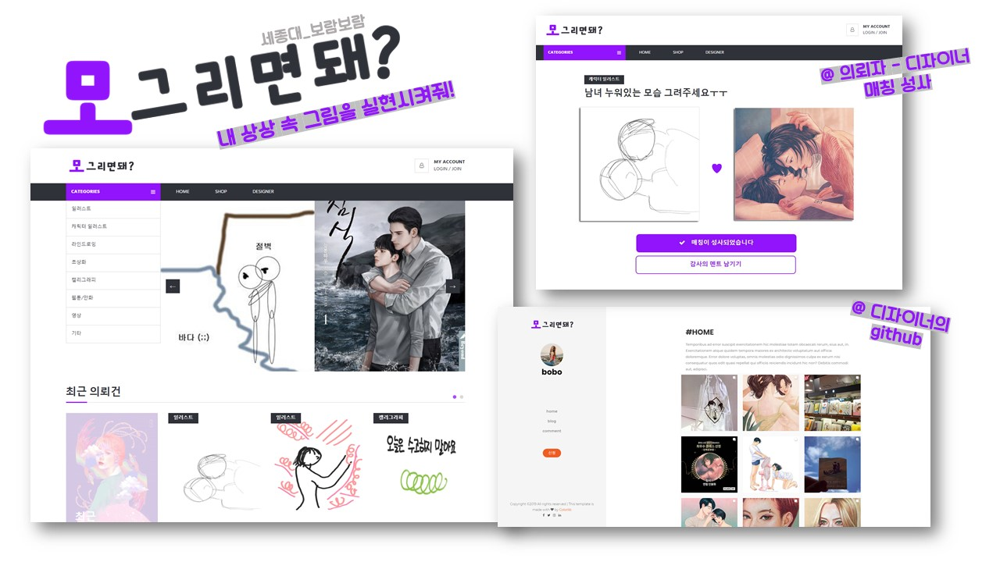
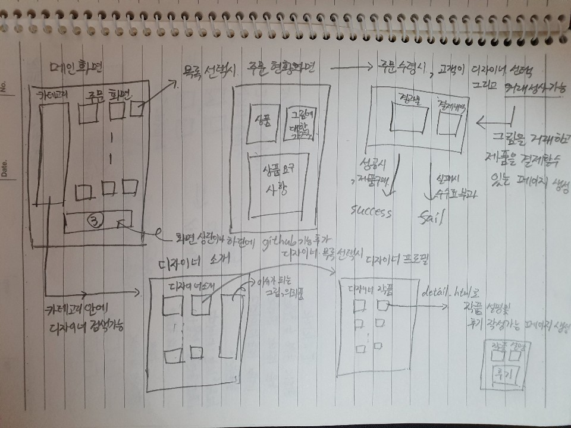

## 2019 멋쟁이사자처럼 해커톤 프로젝트 : 모르면돼?

<STRONG>프로젝트 설명</STRONG>

 넘치는 상상력을 주체하지 못하는 당신의 그림! 그림을 잘 그리는 고수분들에게 도움을 받을 수 있습니다. 머리 속에 떠오르는 이미지가 있지만 표현하기 어려울 때, 아이디어는 넘치지만 내 손이 내 뇌를 따라가지 못할 때, 간단한 구도나 느낌만 표현해도 원하는 이미지로 만들어 드려요.

또는 내가 전문가는 아니지만 그림은 쫌 그린다! 라는 생각이 든다면 여기서 만큼은 '디자이너'의 이름으로 그림을 그려줄 수 있어요. '디자이너'라고 부담스러워 할 필요 없어요!! 세상에 똥손은 너무도 많기 때문에 심심할 때 낙서하는 여러분도 디자이너가 될 수 있답니다

그림을 못그리는 고객들의 추상적인 그림을 구체화 시켜줄 그림 고수분들이 직접 주문을 받아 이익을 창출할 수 있는 플랫폼을 만들려고 합니다!
##
<STRONG>프로젝트 기능</STRONG>
1. 쇼핑몰 형식으로 그림을 주문할 수 있는 기능을 만드는 것
2. 깃헙처럼 디자이너가 그동안 작업했던 예술품을 정리해둔 웹사이트를 만드는 것
3. 그 해당 전시물마다 사람들이 자유롭게 감상평을 적거나 의견을 남기고 그림 주문의뢰로 그려진 전시물은 그 해당 손님에게 후기를 남겨주는 커뮤니티 기능 개발
##
<STRONG>팀원 소개 및 역할</STRONG>

| 이름 | 역할 | 담당 파트 |
|---|:---:|:---:|
|이성령|프론트엔드|메인페이지 설계|
|이경은|프론트엔드|상세페이지 설계|
|설민욱|백엔드|페이지 기능 설계|
|박보람|백엔드|로그인 기능 설계|

* 추후 프로젝트 완성 이후 정리해서 올리겠습니다.

##
<STRONG>사이트 흐름도 및 발표자료</STRONG>
* 해당 자료는 해커톤 대회가 마무리된 이후 프로젝트 발표에 쓰인 자료입니다.

* 간략한 사이트 흐름도입니다.(추후 프로젝트를 하면서 흐름도는 바뀔 수 있습니다.)

##

<STRONG>프로젝트 개발은 2019.8.26~ 2019.8.27에 다시 진행하겠습니다.</STRONG>
