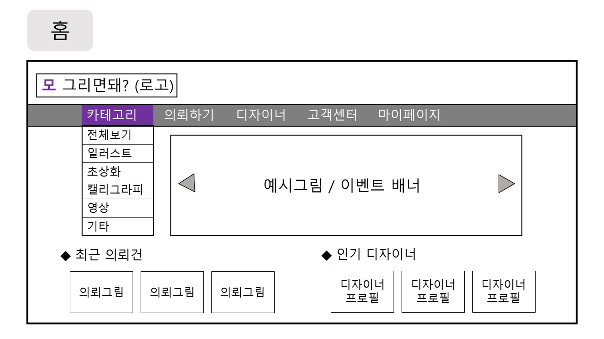
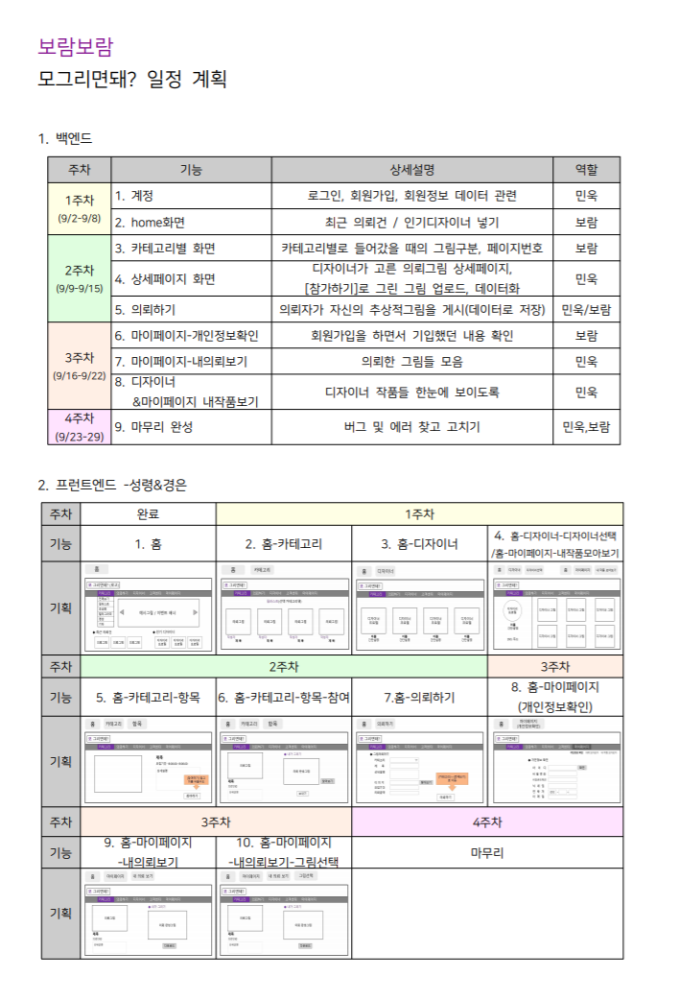
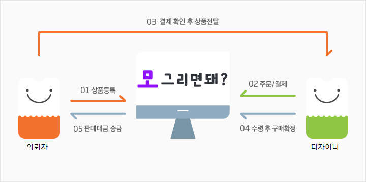

#  모그리면돼? _2019 멋쟁이사자처럼 해커톤 프로젝트
     
> 그림이라는 재능을 사고 팔 수 있는 쇼핑몰 형식 서비스

## :memo:프로젝트 개요

 넘치는 상상력을 주체하지 못하는 당신의 그림! 그림을 잘 그리는 고수분들에게 도움을 받을 수 있습니다. 머리 속에 떠오르는 이미지가 있지만 표현하기 어려울 때, 아이디어는 넘치지만 내 손이 내 뇌를 따라가지 못할 때, 간단한 구도나 느낌만 표현해도 원하는 이미지로 만들어 드려요.

또는 내가 전문가는 아니지만 그림은 쫌 그린다! 라는 생각이 든다면 여기서 만큼은 '디자이너'의 이름으로 그림을 그려줄 수 있어요. '디자이너'라고 부담스러워 할 필요 없어요!! 세상에 똥손은 너무도 많기 때문에 심심할 때 낙서하는 여러분도 디자이너가 될 수 있답니다

그림을 잘 못그리는 고객들의 추상적인 그림을 구체화시켜 주고, 그림그리기가 취미인 이들에게 취미로 수익을 창출할 수 있도록 해주는 서비스 입니다.

## :computer:프로젝트 기능
1. 쇼핑몰 형식으로 고객이 그림을 의뢰하고, 디자이너가 그린 그림을 고객이 구매하면서 서로의 니즈를 충족시킨다.
2.  디자이너가 작업한 작품을 업로드하면서 하나의 포트폴리오가 된다.

## :man_dancing:팀원 소개 및 역할:dancer:

| 이름 | 역할 | 세부사항 |
|---|:---:|:---:|
|이성령|프론트엔드,디자인|HTML, CSS, JavaScript 및 UX 디자인|
|설민욱|백엔드|Django 벡엔드 작업, AWS, |
|박보람|백엔드,문서화|Django 백엔드 작업, 기획, 문서작성|

## :framed_picture: 해커톤발표자료 & 화면구성도</STRONG>
* 발표자료

* 도메인 화면
 *[세부화면기획](./img/보람보람-화면기획최소화버전jpg)*

* 개발일정

## :footprints: UPGRADE
1. 의뢰자와 디자이너의 관계
	- 한 의뢰자가 여러개 의뢰 가능
	- **찜**기능 생성  (찜/선택으로 의뢰자와 디자이너가 맺어짐)
		- 한 의뢰에 대해 여러 디자이너가 "**찜**"가능 -> 의뢰자가 디자이너 1명 **선택**
		- 선택된 디자이너와 컨택하면서 의뢰자가 마음에 들 때까지 수정 가능
		- 그림 최종 선택을 하면 의뢰자는 디자이너에게 페이 지급

2. 디자이너의 포트폴리오
	- 디자이너의 개인작품도 업로드하면서 나만의 저장소로 이용가능

3. 비즈니스모델
	- 광고 수수료
	- 의뢰자와 디자이너간 거래 수수료 (의뢰자와 디자이너간 거래구조)
	
 
 
